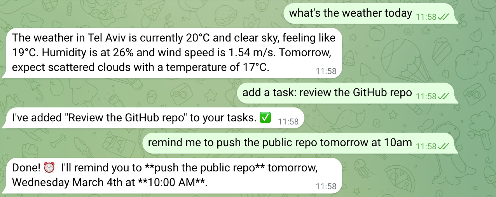
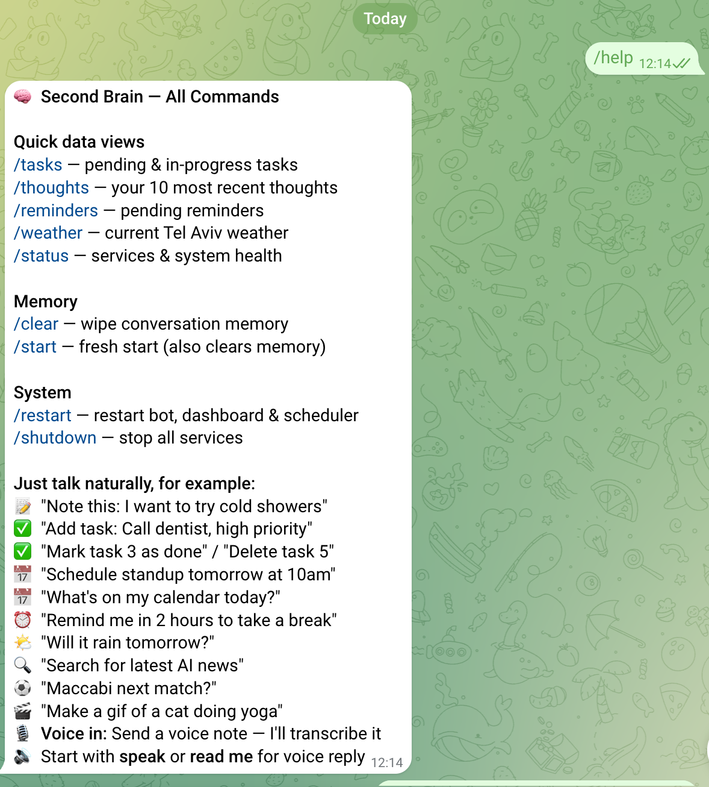
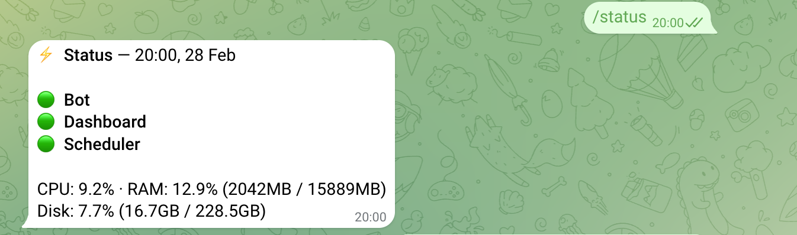
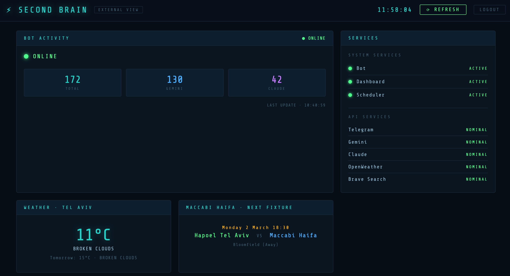
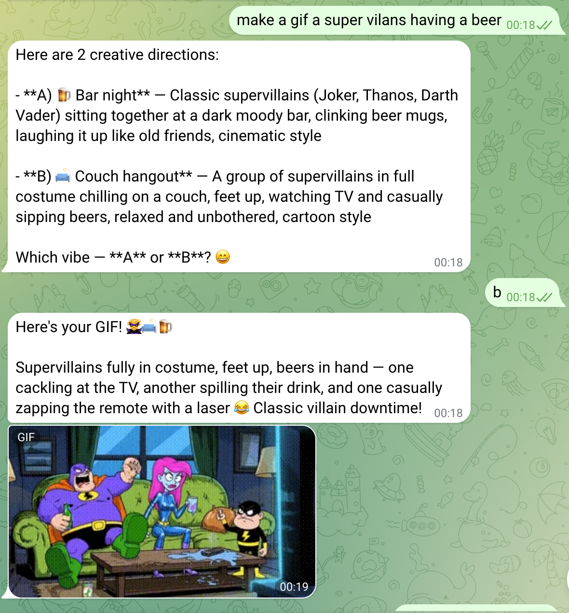

# 🧠 Second Brain Bot

A personal AI assistant that lives in your Telegram and runs on hardware you own.

The key idea: not every message needs an expensive model. A built-in router classifies each message and sends it to either Gemini (fast, free, handles ~80% of queries) or Claude Sonnet (powerful, used only when it matters). You get smart responses without a smart bill.

It runs 24/7 on any Linux box you have lying around — old laptop, mini PC, VPS. It has 22 tools, a live web dashboard, local voice transcription, Google Calendar/Gmail/Tasks integration, reminders, web search, weather, notes, navigation, and GIF generation.

It's not a product. It's infrastructure for your brain.

---

> **Heads up:** This project runs as my daily driver but has not yet been
> tested as a fresh install on a clean machine. Setup guides are written
> carefully but may have rough edges. If something doesn't work, open a
> Discussion — I'll try to fix it fast.

---

## What it does

| Category | Tools |
|---|---|
| **Memory** | Save thoughts, search them, tag them |
| **Tasks** | Add, update, prioritize, complete |
| **Calendar** | Read and write Google Calendar events |
| **Email** | Search and read Gmail |
| **Reminders** | Time-based push notifications via Telegram |
| **Web** | Brave Search, real-time results |
| **Weather** | Current + forecast via OpenWeather |
| **Voice** | Transcribe voice messages locally (Whisper, no API cost) |
| **Media** | Generate GIFs via Google Veo 3 |
| **Navigation** | Google Maps deep links, no API needed |
| **Dashboard** | Live web UI with metrics, logs, task management |

22 tools total. You can enable/disable any of them via config flags — no need to set up Google OAuth if you just want a fast personal search + notes bot.

---

## Screenshots

**The bot in action — Telegram conversation**


**Help menu — all available commands**


**Status check**


**Web dashboard — live metrics and task management**


**GIF generation**


---

## How the routing works

This is the core idea. Every message you send gets classified before anything else happens.

```
You send a message
        ↓
   router.py classifies it
        ↓
  ┌─────────────────────────────┐
  │  FORCE_CLAUDE list?         │ ← always Claude: calendar writes,
  │  Complex keywords?          │   email, GIF generation
  │  Message > 30 words?        │
  └──────────┬──────────────────┘
             │
      yes ───┤─── no
             │         │
          Claude     Gemini
          Sonnet    Flash Lite
         (smart,    (fast, free,
        powerful)   handles ~80%)
             │         │
             └────┬────┘
                  ↓
            tools execute
                  ↓
          response → Telegram
```

**Three routing rules, checked in order:**

1. **Force list** — certain tools always go to Claude regardless of message length. Google Calendar writes, Gmail, GIF generation. Gemini handles these technically but picks wrong parameters — Claude is more reliable for tool calls that need to be exact.

2. **Keyword classification** — `router.py` scans for signal words. "summarize", "explain", "write", "analyze", "compare" → Claude. "weather", "remind", "search", "task", "add" → Gemini.

3. **Length fallback** — anything over 30 words goes to Claude. Short messages are rarely complex.

In practice: Gemini handles around 80% of daily queries. Claude handles the ones that need to be right. The split keeps costs near zero while giving you full model quality when it matters.

You can tune all of this in `router.py` — the lists are plain Python, easy to read and modify.

---

## What you need

### Required — the core bot works with these
| Key | Where to get it | Cost |
|---|---|---|
| Telegram Bot Token | [@BotFather](https://t.me/BotFather) on Telegram | Free |
| Anthropic API Key | [console.anthropic.com](https://console.anthropic.com) | Pay per use (~$0.01–0.05/day typical) |
| Gemini API Key | [aistudio.google.com](https://aistudio.google.com) | Free tier generous |

### Optional — enable the tools you want
| Key | Tool | Cost |
|---|---|---|
| Brave Search API | Web search | Free tier (2000 queries/mo) |
| OpenWeather API | Weather | Free tier |
| Google OAuth | Calendar, Gmail, Tasks | Free (setup takes ~15 min) |
| Google AI Studio key | GIF/video generation (Veo 3) | Pay per use |
| *(none)* | BONUS - Maccabi Haifa FC match schedule | Free (scrapes official site) |

---

## Hardware

Any machine that runs Linux and stays on. Tested on:
- MacBook Pro 2017 running Ubuntu 22.04 ✅
- Raspberry Pi 3B+ ✅ (works, just slower)
- Any VPS ✅

Minimum: 1GB RAM, 4GB disk. The local Whisper model (for voice) needs ~500MB.

---

## Setup

### 1. Clone and configure

```bash
git clone https://github.com/yourusername/second-brain-bot.git
cd second-brain-bot
cp .env.example .env
nano .env   # fill in your keys
```

### 2. Run the setup script

```bash
chmod +x setup.sh
./setup.sh
```

This installs system dependencies (ffmpeg, etc.), creates a Python venv, installs requirements, and runs a health check.

### 3. Enable the tools you want

In your `.env`:

```bash
# Core (always on)
ENABLE_CORE=true

# Optional tool groups — set to false to skip
ENABLE_WEB_SEARCH=true      # needs BRAVE_SEARCH_API_KEY
ENABLE_WEATHER=true         # needs OPENWEATHER_API_KEY
ENABLE_GOOGLE=true          # needs Google OAuth setup (see SETUP_GOOGLE.md)
ENABLE_VOICE=true           # uses local Whisper, no key needed
ENABLE_MEDIA=false          # needs GEMINI_API_KEY + Veo 3 access
```

### 4. Start it

```bash
# Run directly
source venv/bin/activate
python main.py

# Or install as a system service (runs on boot, auto-restarts)
./install-service.sh
```

### 5. Optional: web dashboard

The dashboard runs at `http://localhost:8080`. To expose it publicly with HTTPS:
- Get a free domain at [duckdns.org](https://duckdns.org)
- Install nginx + certbot
- See `SETUP_DASHBOARD.md` for the full nginx config

---

## Google OAuth setup (if you want Calendar / Gmail / Tasks)

This is the most involved part. Takes about 15 minutes once.

See **[SETUP_GOOGLE.md](./SETUP_GOOGLE.md)** for the step-by-step.

Short version:
1. Create a project at [console.cloud.google.com](https://console.cloud.google.com)
2. Enable Calendar, Gmail, Tasks APIs
3. Create OAuth 2.0 credentials → download as `credentials.json`
4. Place in project root
5. First run will open a browser to authorize → creates `token.json`

---

## Keeping it running

Once installed as a service:

```bash
# Check status
sudo systemctl status secondbrain

# View logs
journalctl -u secondbrain -f

# Restart
sudo systemctl restart secondbrain
```

The dashboard shows live metrics, recent conversations, tasks, and system health if you have it running.

---

## Project structure

```
main.py              — Telegram bot, message handling
agent.py             — Dual-model routing, tool dispatch
router.py            — Classifies messages: simple vs complex
scheduler.py         — Reminder firing loop
web_dashboard.py     — Flask dashboard server
tools/               — All 22 tools, one file each
templates/           — Dashboard HTML
data/                — Auto-created on first run (JSON storage)
.env.example         — All config options with explanations
setup.sh             — One-command setup
```

---

## Customizing

**Add a tool:** Create `tools/your_tool.py` with a `TOOL_DEFINITION` dict and a handler function. Register it in `agent.py`. That's it.

**Change routing:** Edit `router.py` — the `FORCE_CLAUDE`, `COMPLEX_KEYWORDS`, and `SIMPLE_KEYWORDS` lists are easy to read and modify.

**Change the system prompt:** Edit the prompt string in `agent.py`. This is where the bot's personality lives.

---

## Cost in practice

Running this as a daily driver:
- **Gemini** handles ~80% of queries → effectively free
- **Claude Sonnet** handles ~20% → roughly $0.01–0.05/day for normal use
- **Voice transcription** → $0 (runs locally via faster-whisper)
- **Everything else** → free tier APIs

Total: a few dollars a month at most, often less.

---

## What this isn't

Not a hosted product. No SaaS. No app. You run it, you own it, your data stays on your machine. The bot only talks to you (enforced via `ALLOWED_USER_ID` in config).

---

## License

MIT. Fork it, break it, rebuild it.

---

*Built for personal use, made public because it turned out to be genuinely useful infrastructure.*

